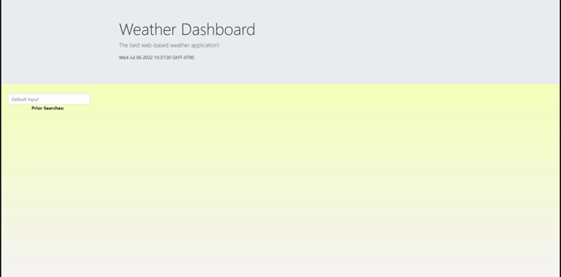

# [WeatherDashboard](https://henry11244.github.io/WeatherDashboard/)

 

<h3 align="center">Weather Dashboard</h3>

  

    Browser-based weather dashboard
     
  

  
Table of Contents

  <ol>
    <li>
      <a href="#about-the-project">About The Project</a>
      <ul>
        <li><a href="#tools-used">Tools used</a></li>
      </ul>
    </li>
    <li>
      <a href="#instructions">Instructions</a>
        </li>
    <li><a href="#license">License</a></li>
    <li><a href="#contact">Contact</a></li>
  </ol>

## About The Project

The motivation behind this project is to design an intuitive dashboard that can pull weather data for any location as well as display information that is both useful and readable to the user.

(<a href="#top">back to top</a>)

### Tools used

* JavaScript
* CSS
* HTML

(<a href="#top">back to top</a>)

## Instructions

Once you have navagated to the webpage: 

- You are presented with the current date and time.
- You are able to navagate to the search bar and enter a city in which you wish to view weather data for.
- Weather information is then displayed for the current day as well as the next five days.
- Prior searches are saved locally so they persist on refreshing the webpage.

(<a href="#top">back to top</a>)

## License

Distributed under the MIT License. See `LICENSE.txt` for more information.

(<a href="#top">back to top</a>)

## Contact

Henry Nguyen -  hln11244@gmail.com

Project Link: [https://github.com/henry11244/WeatherDashboard](https://github.com/henry11244/WeatherDashboard)

(<a href="#top">back to top</a>)

[linkedin-url]: https://www.linkedin.com/in/henry11244/
